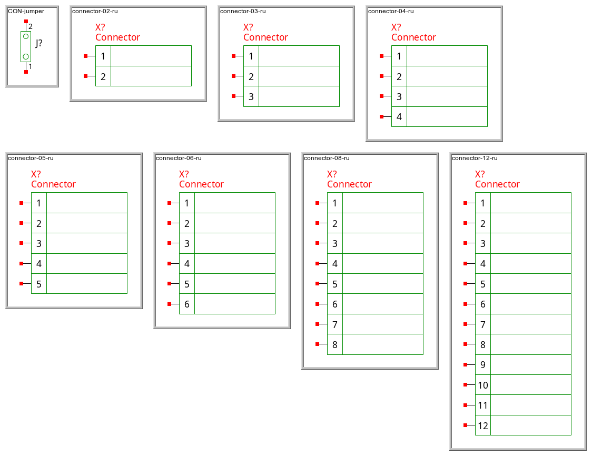
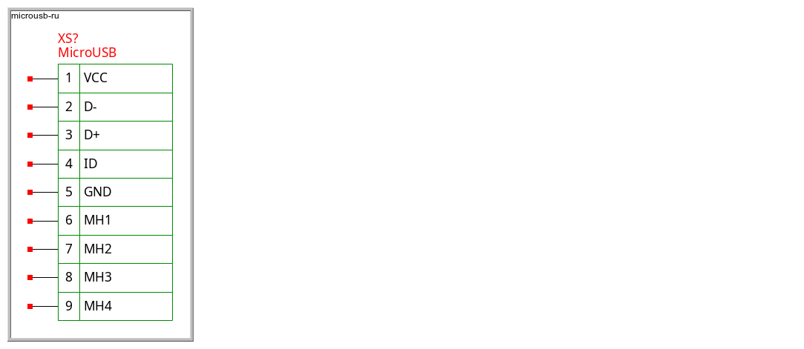
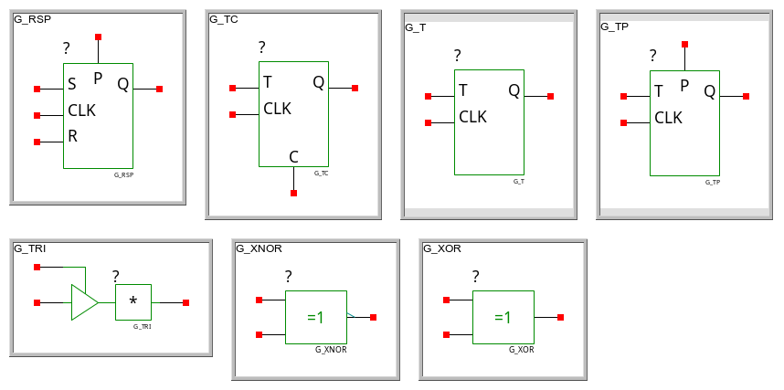

AWESOME LEPTON SYMBOLS
======================

This is a collection of symbols for [Lepton EDA](https://github.com/lepton-eda/lepton-eda).

## Installation instructions

    $ sudo make install PREFIX=/usr

## Symbol Sources (All credit to these people)

- https://github.com/bert/gschem-symbols
- https://github.com/CWRU-EE/gschem-symbols
- https://github.com/salfter/gschem-symbols
- https://github.com/backerman/gedasyms
- https://github.com/stefanct/gedasymbols
- https://github.com/jonronen/geda-stuff
- https://github.com/tomahawkins/hydraulics
- https://github.com/UncleRus/gsymbols

## Symbol Catalog

- [Connectors](#Connectors)
- [Component Symbols](#Component-Symbols)
- [Power](#Power)
- [Generic Symbols](#Generic-Symbols)
- [GHDL circuits](#GHDL-circuits)
- [Hydraulic circuits](#Hydraulic-circuits)
- [Installation](#Installation)
- [Process and Instrumentation Diagrams](#Process-and-Instrumentation-Diagrams)
- [Sheets](#Sheets)
- [Structural steel schematics](#Structural-steel-schematics)
- [VHDL](#VHDL)
- [Diodes](#Diodes)
- [Audio devices](#Audio-devices)

### Connectors

<table>
  <tr>
    <th>CON-64 CON-BNC CON-DIN41617-31p-female CON-DIN41617-31p-male CON-HDR-254P-2C-13R-26 CON-HDR-254P-2C-16R-32 CON-HDR-254P-2C-3R-6 CON-HDR-254P-2C-5R-10 </th>
  </tr>
  <tr>
    <td></td>
  </tr>
  <tr>
    <th>CON-jumper connector-02-ru connector-03-ru connector-04-ru connector-05-ru connector-06-ru connector-08-ru connector-12-ru </th>
  </tr>
  <tr>
    <td></td>
  </tr>
  <tr>
    <th>connector-20-ru connector-24-ru connector-40-ru conn-pin-01-ru conn-pin-02-ru conn-pin-03-ru conn-pin-04-ru conn-pin-05-ru </th>
  </tr>
  <tr>
    <td></td>
  </tr>
  <tr>
    <th>conn-pin-06-ru conn-pin-07-ru conn-pin-08-ru conn-pin-09-ru conn-pin-10-ru conn-pin-40-ru conn-sock-01-ru conn-sock-02-ru </th>
  </tr>
  <tr>
    <td></td>
  </tr>
  <tr>
    <th>conn-sock-03-ru conn-sock-04-ru conn-sock-05-ru conn-sock-06-ru conn-sock-07-ru conn-sock-08-ru conn-sock-09-ru conn-sock-10-ru </th>
  </tr>
  <tr>
    <td></td>
  </tr>
  <tr>
    <th>conn-term-02-ru conn-term-03-ru conn-term-04-ru conn-term-05-ru conn-term-06-ru conn-term-07-ru conn-term-08-ru conn-term-09-ru </th>
  </tr>
  <tr>
    <td></td>
  </tr>
  <tr>
    <th>conn-term-11-ru conn-term-14-ru CON-power-jack_NO CON-SIL-254P-10 CON-SIL-254P-12 CON-SIL-254P-16 CON-SIL-254P-20 CON-SIL-254P-2 </th>
  </tr>
  <tr>
    <td></td>
  </tr>
  <tr>
    <th>CON-SIL-254P-31 CON-SIL-254P-3 CON-SIL-254P-4 CON-SIL-254P-5 CON-SIL-254P-6 CON-SIL-254P-7 CON-SIL-254P-8 CON-solder-jumper_NC </th>
  </tr>
  <tr>
    <td></td>
  </tr>
  <tr>
    <th>CON-solder-jumper_NO CON-TERM-2p CON-TESTPOINT CON-TP CON-USB-MINI dip40-1 jumper-2-ru jumper-ru </th>
  </tr>
  <tr>
    <td></td>
  </tr>
  <tr>
    <th>microusb-ru </th>
  </tr>
  <tr>
    <td></td>
  </tr>
</table>

### Component Symbols

<table>
  <tr>
    <th>3-terminal-cap-1 4N2x-ru 4N35-1-cw 74138_np 74138 74138_pwr 74151_np 74151 </th>
  </tr>
  <tr>
    <td></td>
  </tr>
  <tr>
    <th>74151_pwr 7416245 7416245-pwr-1 74221 74244-extpwr-1 74377-extpwr-1 74393_np 74393 </th>
  </tr>
  <tr>
    <td></td>
  </tr>
  <tr>
    <th>74393_pwr 7447_np 7447 7447_pwr 74573_np 74573 74573_pwr 7479-extpwr-1 </th>
  </tr>
  <tr>
    <td></td>
  </tr>
  <tr>
    <th>7486 7493_np 7493 7493_pwr 74power-2 74power-3 74power-4 A2BUS-sa </th>
  </tr>
  <tr>
    <td></td>
  </tr>
  <tr>
    <th>A4988 AD7705-ru AD822AN_np AD822AN AD822AN_pwr AD8307AN_np AD8307AN AD8307AN_pwr </th>
  </tr>
  <tr>
    <td></td>
  </tr>
  <tr>
    <th>AD8307AR_np AD8307AR AD8307AR_pwr AD9850BRS ADS1115_np ADS1115 ADS1115_pwr ADS1115-ru </th>
  </tr>
  <tr>
    <td></td>
  </tr>
  <tr>
    <th>ADXL345-cw ADXL345-ru AMS1117-ru antenna-ru APK2112K-1.2TRG1 APK2112K-1.8TRG1 APK2112K-2.5TRG1 APK2112K-2.6TRG1 </th>
  </tr>
  <tr>
    <td></td>
  </tr>
  <tr>
    <th>APK2112K-2.8TRG1 APK2112K-3.3TRG1 arrows-ru AT24C32 AT42QT1011-1-cw ATmega128-1-jn ATmega128-2-jn ATmega128-3-jn </th>
  </tr>
  <tr>
    <td></td>
  </tr>
  <tr>
    <th>ATmega2560-16AU-ru ATmega328-AU_np ATmega328-AU ATmega328-AU_pwr ATmega328-AU_ref ATMega328-cw atmega328-jn atmega328p-jn </th>
  </tr>
  <tr>
    <td></td>
  </tr>
  <tr>
    <th>ATmega328p-TQFP32-ru ATmega328-PU ATmega32U2 atmega48_88_168-cw atmega48_88_168_pdip-cw ATmega8_np ATmega8 ATmega8_portB </th>
  </tr>
  <tr>
    <td></td>
  </tr>
  <tr>
    <th>ATmega8_portC ATmega8_portD ATmega8_pwr ATmega8_ref attiny13-jn AVR_ISP10-1 AVR_ISP6-1 BAT_LIR2032 </th>
  </tr>
  <tr>
    <td></td>
  </tr>
  <tr>
    <th>battery1-ru battery2-ru BC548 BMA220-cw BMP180-ru BPX85 button-closed-ru button-ru </th>
  </tr>
  <tr>
    <td></td>
  </tr>
  <tr>
    <th>C64_Expansion_Port-sa CA3140AM_np CA3140AM CA3140AM_pwr CA3140A_np CA3140A CA3140A_pp CA3140A_pwr </th>
  </tr>
  <tr>
    <td></td>
  </tr>
  <tr>
    <th>CA3140M_np CA3140M CA3140M_pp CA3140M_pwr CA3140_np CA3140 CA3140_pp CA3140_pwr </th>
  </tr>
  <tr>
    <td></td>
  </tr>
  <tr>
    <th>capacitor-polarized-ru capacitor-ru CB3LV CH340G-ru CMR3000-cw CNY17 coil1-ru coil2-ru </th>
  </tr>
  <tr>
    <td></td>
  </tr>
  <tr>
    <th>coil3-ru CON_MAINS_SOCKET+SW_DPST crystal2-ru crystal-ru DDC114-1 DDC114-pwr-1 DDC114-pwr-2 DS1307-ru </th>
  </tr>
  <tr>
    <td></td>
  </tr>
  <tr>
    <th>DS1307Z DS18B20_TO92 DS3231-ru dsub_DB25f-cw dsub_DC37f-cw ELS-432x EPS000123-12_np EPS000123-12 </th>
  </tr>
  <tr>
    <td></td>
  </tr>
  <tr>
    <th>EPS000123-12_pwr EPS946639-1_np EPS946639-1 EPS946639-1_pwr EPS946639-2_np EPS946639-2 EPS946639-2_pwr ESP12-ru </th>
  </tr>
  <tr>
    <td></td>
  </tr>
  <tr>
    <th>FT232RL fuse-ru GAL22V10_DIP24_np GAL22V10_DIP24 GAL22V10_DIP24_pwr GP3906-TLP HD1107-O_DIP14300 HDSM-431x </th>
  </tr>
  <tr>
    <td></td>
  </tr>
  <tr>
    <th>HDSM-433x header4-1 header44-2mm-jn HMC5883L-ru ina217-jn IRF1010N IRF9388 ispGAL22V10_PLCC28_np </th>
  </tr>
  <tr>
    <td></td>
  </tr>
  <tr>
    <th>ispGAL22V10_PLCC28 ispGAL22V10_PLCC28_pwr jumper-2x2-2 KIS-3R33S-ru L293DD-ru L4971-ru L4978-ru LCD-HD44780-ru </th>
  </tr>
  <tr>
    <td></td>
  </tr>
  <tr>
    <th>LDO-jn LDO-ru LED-45 led-double-ru LED led-ru lightbulb LM1117-3.3-jn </th>
  </tr>
  <tr>
    <td></td>
  </tr>
  <tr>
    <th>LM1117 LM237 LM311_np LM311 LM311_pwr LM337 LM358_np LM358 </th>
  </tr>
  <tr>
    <td></td>
  </tr>
  <tr>
    <th>LM358_pp LM358_pwr LM358-ru LM41xx-1 LM741_np LM741 LM741_pp LM741_pwr </th>
  </tr>
  <tr>
    <td></td>
  </tr>
  <tr>
    <th>LM7805-ru LM78M05 LM78xx LM78xx_TO-3 LM79xx LTC1682 LTV847-ru MC34063-ru </th>
  </tr>
  <tr>
    <td></td>
  </tr>
  <tr>
    <th>MC34071-ru MCP23017-ru MCP3008-ru MCP9700-cw mosfet-jn MP2307-ru MPDC-cw MS5611-ru </th>
  </tr>
  <tr>
    <td></td>
  </tr>
  <tr>
    <th>MTP3055V my_pushbutton-jn NCP1402-1-cw nmosfet-TO220-cw nmosfet-TO92-cw nodemcu-ru npn-TO220-cw OP07-ru </th>
  </tr>
  <tr>
    <td></td>
  </tr>
  <tr>
    <th>opamp-jn optocoupler1-ru osc-enable-1 oscillator2-ru oscillator-ru PBRC-H-cw PCB_Arduino_R3_Shield PCF8574-ru </th>
  </tr>
  <tr>
    <td></td>
  </tr>
  <tr>
    <th>pcm3060-jn picaxe28x1-1-cw pi-filter PowerJack-2-cw PowerJack-2-jn PowerJack-3-jn psd_2d-1 pwrjack-2-ba </th>
  </tr>
  <tr>
    <td></td>
  </tr>
  <tr>
    <th>RaspberryPi3-ru REF31xx-1 relay1-ru relay_solid-ru resistor-0w05-ru resistor-0w125-ru resistor-0w5-ru resistor-10w-ru </th>
  </tr>
  <tr>
    <td></td>
  </tr>
  <tr>
    <th>resistor-1w-ru resistor-2w-ru resistor-5w-ru resistor-ru resistor-variable1-ru resistor-variable2-ru RGBled-ba RN131C-1-cw </th>
  </tr>
  <tr>
    <td></td>
  </tr>
  <tr>
    <th>Rotary-Encoder-5Pin-jn rpi-gpio-sa SA56-ba SAA1064-ba screw2-1-cw screw3-1-cw seven-seg-cw spi-flash-8pin </th>
  </tr>
  <tr>
    <td></td>
  </tr>
  <tr>
    <th>stereo-1-jn SW_Apem_5536__ SW_Apem_5537__ SW_Apem_5546__ SW_Apem_5547__ SW_Apem_5556__ SW_Apem_5557__ SW_Apem_5566__ </th>
  </tr>
  <tr>
    <td></td>
  </tr>
  <tr>
    <th>SW_Apem_5567__ SW_Apem_5646M__ switch-2-ru switch-block-2-ru switch-closed-ru switch-ru switch-spdt-2-cw SW_Lorlin___4p3t_ </th>
  </tr>
  <tr>
    <td></td>
  </tr>
  <tr>
    <th>SW_Mountain_101-TS6111T1601-EV__ SX28AC_DP_np SX28AC_DP SX28AC_DP_pwr TC1015-cw TC74-ba thyristor TL431-2-ru </th>
  </tr>
  <tr>
    <td></td>
  </tr>
  <tr>
    <th>TL431-ru transformer-1-ru transistor-igbt-ru transistor-jfet-n-ru transistor-jfet-p-ru transistor-mosfet-n-ru transistor-mosfet-p-ru transistor-npn-ru </th>
  </tr>
  <tr>
    <td></td>
  </tr>
  <tr>
    <th>transistor-pnp-ru transistor-TO92-cw TS921_np TS921 TS921_pp TS921_pwr U1096B_np U1096B </th>
  </tr>
  <tr>
    <td></td>
  </tr>
  <tr>
    <th>U1096B_pwr UAA170_np UAA170 UAA170_pp UAA170_pwr UCC27xxx-jn uda1345-jn voltage-regulator-ru </th>
  </tr>
  <tr>
    <td></td>
  </tr>
  <tr>
    <th>W65C51N6TPG-sa W65C51N6TPLG-sa WS2812B-ru xbee-cw XFMR_ERA_UI39-21__ XL4005-ru XL4016-ru XTAL-1-jn </th>
  </tr>
  <tr>
    <td></td>
  </tr>
</table>

### Power

<table>
  <tr>
    <th>12v-ru 15V-minus 15V-plus 3v3_CPU-ru 3v3-ru 3V5-minus 5v-ru 8V-minus </th>
  </tr>
  <tr>
    <td></td>
  </tr>
  <tr>
    <th>8V-plus avcc gnd1-ru gnd2-ru ld1117_vreg-2 pwr_Vcc_12_GND_9 pwr_Vcc_14_GND_7 pwr_Vcc_16_GND_8 </th>
  </tr>
  <tr>
    <td></td>
  </tr>
  <tr>
    <th>pwr_Vcc_20_GND_10 pwr_Vcc_24_GND_12 pwr_Vcc_28_GND_14 pwr_Vcc_4_GND_11 pwr_Vcc_4_GND_2 pwr_Vcc_5_GND_10 pwr_Vcc_7_GND_2 pwr_Vcc_7_GND_4 </th>
  </tr>
  <tr>
    <td></td>
  </tr>
  <tr>
    <th>pwr_Vcc_7_GND_8 pwr_Vcc_8_GND_4 vcc-ru </th>
  </tr>
  <tr>
    <td></td>
  </tr>
</table>

### Generic Symbols

<table>
  <tr>
    <th>50Ohm CC-BY-SA current diff_pair memristor nc ntc ptc </th>
  </tr>
  <tr>
    <td></td>
  </tr>
  <tr>
    <th>solder-bridge tvs </th>
  </tr>
  <tr>
    <td></td>
  </tr>
</table>

### GHDL circuits

<table>
  <tr>
    <th>G_2AND1 G_2AND2 G_2AND G_2NAND1 G_2NAND2 G_2NAND G_2NOR1 G_2NOR2 </th>
  </tr>
  <tr>
    <td></td>
  </tr>
  <tr>
    <th>G_2NOR G_2OR1 G_2OR2 G_2OR G_3AND1 G_3AND2 G_3AND3 G_3AND </th>
  </tr>
  <tr>
    <td></td>
  </tr>
  <tr>
    <th>G_3NAND1 G_3NAND2 G_3NAND3 G_3NAND G_3NOR1 G_3NOR2 G_3NOR3 G_3NOR </th>
  </tr>
  <tr>
    <td></td>
  </tr>
  <tr>
    <th>G_3OR1 G_3OR2 G_3OR3 G_3OR G_4AND1 G_4AND2 G_4AND3 G_4AND4 </th>
  </tr>
  <tr>
    <td></td>
  </tr>
  <tr>
    <th>G_4AND G_4NAND1 G_4NAND2 G_4NAND3 G_4NAND4 G_4NAND G_4NOR1 G_4NOR2 </th>
  </tr>
  <tr>
    <td></td>
  </tr>
  <tr>
    <th>G_4NOR3 G_4NOR4 G_4NOR G_4OR1 G_4OR2 G_4OR3 G_4OR4 G_4OR </th>
  </tr>
  <tr>
    <td></td>
  </tr>
  <tr>
    <th>G_BIDIR G_BUFB G_BUF G_CLKBUF G_DC G_DEC G_DEPC G_DEP </th>
  </tr>
  <tr>
    <td></td>
  </tr>
  <tr>
    <th>G_DPC G_D G_DP G_FADD G_HADD G_INPUT G_INV G_JKC </th>
  </tr>
  <tr>
    <td></td>
  </tr>
  <tr>
    <th>G_JK G_JKP G_LATCH G_MUX21 G_MUX41 G_OUTPUT G_RSC G_RS </th>
  </tr>
  <tr>
    <td></td>
  </tr>
  <tr>
    <th>G_RSP G_TC G_T G_TP G_TRI G_XNOR G_XOR </th>
  </tr>
  <tr>
    <td></td>
  </tr>
</table>

### Hydraulic circuits

<table>
  <tr>
    <th>accumulator air-tank arrow check cooler cylinder directional-3-2 directional-check-nc-2-2 </th>
  </tr>
  <tr>
    <td></td>
  </tr>
  <tr>
    <th>directional-check-no-2-2 directional-nc-2-2 directional-no-2-2 exhaust filter flexible flow-indicator motor-fd </th>
  </tr>
  <tr>
    <td></td>
  </tr>
  <tr>
    <th>motor-vd orifice power-transfer-unit-fd power-transfer-unit-vd pressure-indicator proportional-4-3 pump-fd pump-motor-vd </th>
  </tr>
  <tr>
    <td></td>
  </tr>
  <tr>
    <th>pump-vd relief reservoir temperature-indicator </th>
  </tr>
  <tr>
    <td></td>
  </tr>
</table>

### Installation

<table>
  <tr>
    <th>junctionbox-8 light light-TL switch-1P switch-2P switch-XP wall-outlet+GND wall-outlet </th>
  </tr>
  <tr>
    <td></td>
  </tr>
</table>

### Process and Instrumentation Diagrams

<table>
  <tr>
    <th>ball-valve cap check-valve compressor fan flange globe-valve pump </th>
  </tr>
  <tr>
    <td></td>
  </tr>
  <tr>
    <th>reducer-concentric reducer-eccentric valve-3way-hand valve-3way-L valve-3way valve-3way-T valve-hand valve-motor </th>
  </tr>
  <tr>
    <td></td>
  </tr>
  <tr>
    <th>valve-pneumatical valve valve-solenoid </th>
  </tr>
  <tr>
    <td></td>
  </tr>
</table>

### Sheets

<table>
  <tr>
    <th>A0-sheet A1-sheet A3-sheet_000 A3-sheet+columns A3-sheet A4P-sheet_000 A4P-sheet CC-BY-SA </th>
  </tr>
  <tr>
    <td></td>
  </tr>
  <tr>
    <th>input label list_entry list_header Made_in_NL OSHW output rev_entry </th>
  </tr>
  <tr>
    <td></td>
  </tr>
  <tr>
    <th>rev_header rev_matrix </th>
  </tr>
  <tr>
    <td></td>
  </tr>
</table>

### Structural steel schematics

<table>
  <tr>
    <th>fixed force hinged node roller </th>
  </tr>
  <tr>
    <td></td>
  </tr>
</table>

### VHDL

<table>
  <tr>
    <th>AND2 BI11 BUF FD11 FD14 FJK11 FJK21 IB11 </th>
  </tr>
  <tr>
    <td></td>
  </tr>
  <tr>
    <th>INV NAND2 OB11 PAD TAG_BIDIR TAG_INPUT TAG_OUTPUT </th>
  </tr>
  <tr>
    <td></td>
  </tr>
</table>

### Diodes

<table>
  <tr>
    <th>diode-bridge-ru diode-ru diode-schottky-double-ru diode-schottky-ru diode-tunnel-ru diode-zener2-ru diode-zener-ru schottky-dual-anode-1 </th>
  </tr>
  <tr>
    <td></td>
  </tr>
  <tr>
    <th>schottky-dual-cathode-1 schottky-dual-serial-1 zener_SOT23-2 </th>
  </tr>
  <tr>
    <td></td>
  </tr>
</table>

### Audio devices

<table>
  <tr>
    <th>microphone1 microphone2 speaker </th>
  </tr>
  <tr>
    <td></td>
  </tr>
</table>
