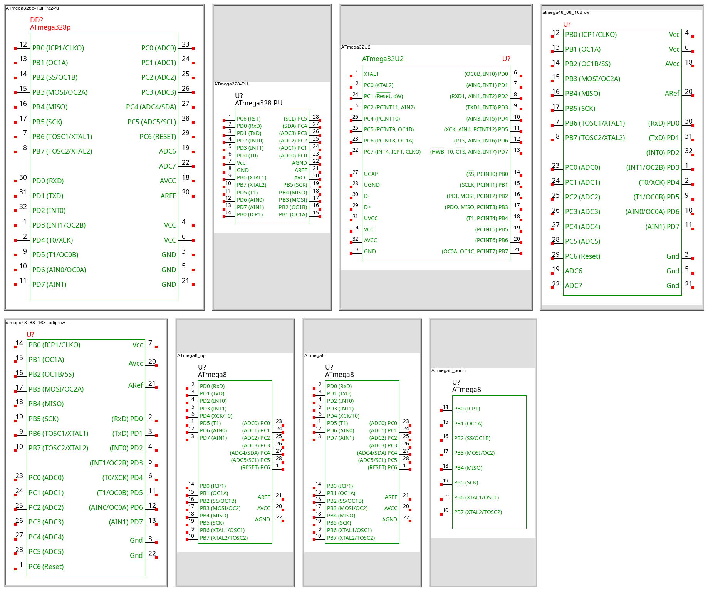
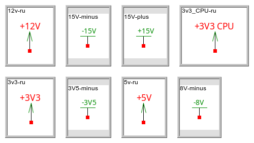

AWESOME LEPTON SYMBOLS
======================

This is a collection of symbols for [Lepton EDA](https://github.com/lepton-eda/lepton-eda).

## Installation

    $ sudo make install PREFIX=/usr

## Symbol Sources (All credit to these people)

- https://github.com/bert/gschem-symbols
- https://github.com/CWRU-EE/gschem-symbols
- https://github.com/salfter/gschem-symbols
- https://github.com/backerman/gedasyms
- https://github.com/stefanct/gedasymbols
- https://github.com/jonronen/geda-stuff
- https://github.com/tomahawkins/hydraulics
- https://github.com/UncleRus/gsymbols

## Symbol Catalog

- [Connectors](#Connectors)
- [Component Symbols](#Component-Symbols)
- [Power](#Power)
- [Generic Symbols](#Generic-Symbols)
- [GHDL circuits](#GHDL-circuits)
- [Hydraulic circuits](#Hydraulic-circuits)
- [Installation](#Installation)
- [Process and Instrumentation Diagrams](#Process-and-Instrumentation-Diagrams)
- [Sheets](#Sheets)
- [Structural steel schematics](#Structural-steel-schematics)
- [VHDL](#VHDL)
- [Diodes](#Diodes)
- [Audio devices](#Audio-devices)

### Connectors

### Component Symbols

### Power

### Generic Symbols

### GHDL circuits

### Hydraulic circuits

### Installation

### Process and Instrumentation Diagrams

### Sheets

### Structural steel schematics

### VHDL

### Diodes

### Audio devices

